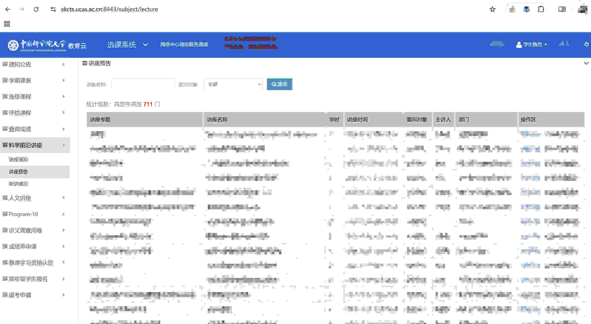
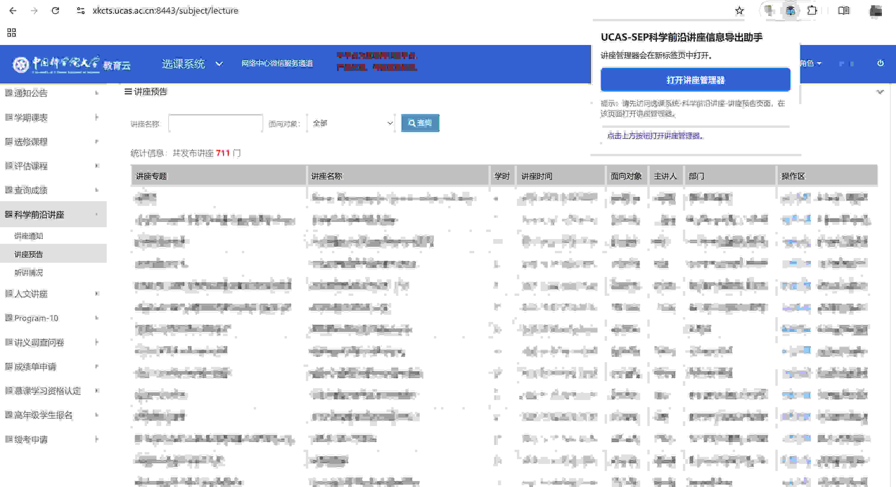
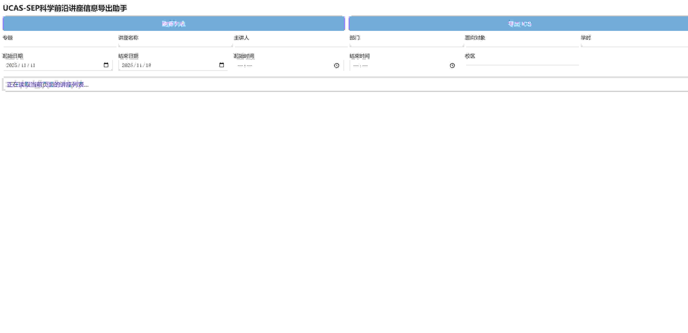
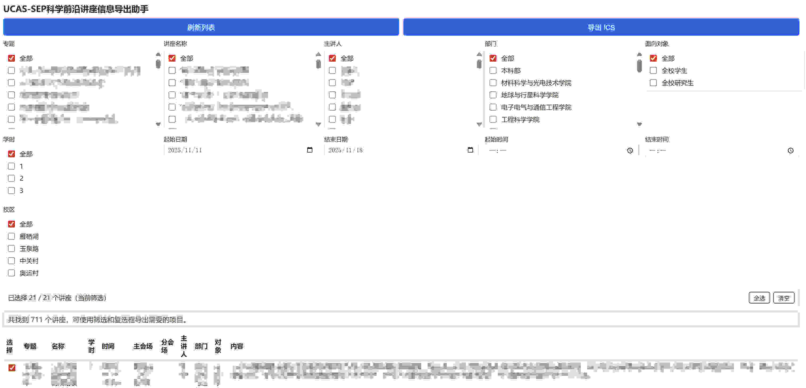

# UCAS-SEP科学前沿讲座信息导出助手

> SEP能做的好用一点也不至于得写这个扩展！

本浏览器扩展可抓取国科大科学前沿讲座日程，提供一个带筛选功能的可视化管理面板，并能批量导出干净的 `.ics` 日历文件（包含单行描述、结构化场地信息、校区筛选等），方便一键导入到各类日历应用（如 Google Calendar, Outlook, Apple Calendar 等）。

## 🌟 项目起源与致谢

本项目的核心思路与灵感来源于 **Gregory Conrad** 的项目 [**WorkdayScheduleExporter**](https://github.com/GregoryConrad/WorkdayScheduleExporter/) (原作者的项目名，请替换为正确的名称和链接)。

在原项目的基础上，本项目进行了大规模的重构和功能扩展。

1.  **代码重构:** 为了提高代码的可维护性并适配讲座系统，本项目在 Codex 等 AI 工具的辅助下，对原有代码进行了深度的重构和优化。
2.  **新功能:** 添加了讲座详情抓取、多校区筛选、`ics` 文件导出等一系列原版不具备的特性。

本项目并非原项目的“分支”(fork)，而是一个受其启发的、在代码结构和功能上已大不相同的续作。

再次感谢 Gregory Conrad 的开创性工作和 MIT 许可下的慷慨开源。Thx!

---

## ✨ 功能特性

* **完整抓取：** 自动遍历所有分页，收集完整的讲座列表（包括讲座详情页内容）。
* **管理面板：** 提供一个专属的管理标签页，具备丰富的筛选器、批量选择和详情懒加载功能。
* **校区筛选：** 自动识别 **主会场** 和 **分会场** 地址，并提供一个“校区”多选筛选器（雁栖湖 / 玉泉路 / 中关村 / 奥运村），可匹配多场地。
* **干净的ICS：** 生成 `.ics` 文件时，会将描述信息扁平化为单行，并将地点信息格式化（例如：`主会场：XX，分会场：XX`），确保在日历应用中显示清爽、无错位。

## 📦 安装与加载

### 仅使用

1.  访问本项目的Releases 页面。
2.  下载最新的 `extension.zip` 压缩包文件。
3.  **!! 重要：解压缩这个 .zip 文件。**
    * 你会得到一个包含所有扩展文件的文件夹 (里面应该有 `manifest.json` 等文件)。
    * 请将这个**解压后的文件夹**移动到一个**固定的、你不会误删的位置** (例如 "我的文档" 下)。
    > **注意：** 浏览器每次启动都需要从这个位置读取文件，如果你移动或删除了它，扩展会失效。
4.  打开 Edge (或 Chrome) 浏览器。
5.  在地址栏输入 `edge://extensions` (Edge) 或 `chrome://extensions` (Chrome) 并按回车。
6.  在页面右上角，找到并打开 **“开发者模式”** (Developer mode) 的开关。
7.  点击左侧的 **“加载已解压的扩展程序”** (Load unpacked) 按钮。
8.  在弹出的窗口中，**选择你刚刚解压并存放好的那个文件夹**。
9.  安装完成！建议点击工具栏的拼图图标 🧩，将本扩展“固定”在工具栏上，方便使用。

### 开发

1.  **安装依赖：**
    ```bash
    npm install
    ```
2.  **编译扩展：**
    ```bash
    npm run build
    ```
3.  **加载扩展：**
    * **Chrome/Edge:** 打开 "扩展" -> "管理扩展"，开启“开发者模式”，点击“加载已解压的扩展程序”，然后选择本项目中的 `out/` 文件夹。
    * **Firefox:** 访问 `about:debugging` → "此 Firefox" → "加载临时附加组件…"，然后选择 `out/manifest.json` 文件。
4.  **固定图标：**（推荐）将扩展图标固定到浏览器工具栏，方便快速访问。

> 💡 **提示：** 运行 `npm run build-zip` 命令将通过 `web-ext build` 自动打包生成 `extension.zip` 压缩包，方便你将其分发给他人测试。

## 🚀 如何使用

1.  访问国科大讲座系统官方页面：选课系统-科学前沿讲座-讲座预告页面，该页面网址类似 https://xkcts.ucas.ac.cn:xxxx/subject/lecture，xxxx为端口。（请确保你已登录SEP）。
2.  点击浏览器工具栏上的扩展图标，在弹出窗口中点击 “**打开讲座管理器**”。
3.  这会打开一个新的管理标签页。稍等片刻，保持网络流畅，表格会自动懒加载讲座详情（如“内容”、“主会场”、“分会场”等信息）。当详情页面解析完成后，表格中的对应列会自动填充更新。
4.  在页面顶部使用筛选器（如标题、日期、校区）来缩小讲座范围。使用表格上方的选择工具栏（或行首的复选框）来挑选你需要的讲座，然后点击 “**导出 ICS**”。
6.  `.ics` 文件将立即下载，你可以将此文件导入到你使用的任何日历应用中（如 Outlook, Google Calendar 或 iOS 设备。至于如何导入，可参考这篇博文：https://miaotony.xyz/NUAA_ClassSchedule/HowToImport.html
7. 如果报错，关闭弹出界面，重启一次；或重启本插件。
8. 因为本插件一次抓取所有的科学前沿讲座，不用再翻页，所以不必多次刷新。

## 🛠️ 开发者说明

* `npm run build-content-script`、`npm run build-manager` 等命令可以单独运行；`npm run build` 会按顺序执行全部构建。
* `postinstall` 脚本会自动修补 (patch) `tsify` 包，以避免在构建时触发已弃用的 `util._extend` 警告。如果 `node_modules` 目录被删除，只需重新运行 `npm install`，该脚本将自动重新应用此修复。
* `scripts/apply-tsify-patch.js` 脚本有意保持了简洁。如果上游 `tsify` 包的内部结构发生变化，你可能需要更新此脚本。
* 如果国科大讲座页面的 HTML 结构发生变化，你主要需要修改 `src/parser.ts` 文件。如果你希望在管理界面添加更多筛选器或表格列，可以修改 `src/manager.ts` 和 `out/manager.html`。